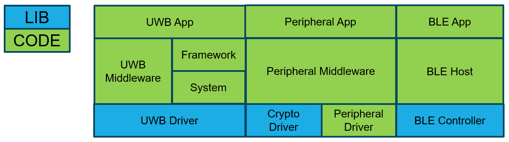
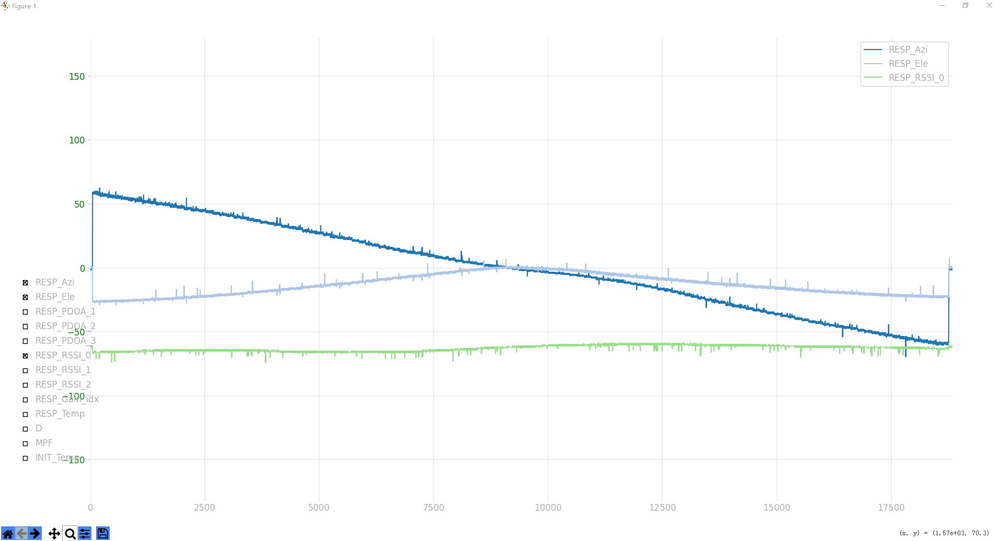

# CBU5000V210 UWB SoC开发套件

## 概述
该SDK为CBU5000V210官方提供了UWB和外设相关功能的开发套件，包括基础外设例程、UWB功能例程和FreeRTOS等第三方组件，使用此SDK可快速开发UWB相关应用。

## 软件框架图




### 功能模块
包含以下功能模块：
- **基础外设接口**：UART、I2C、SPI、GPIO、TIMER等
- **UWB无线数传**
- **PDOA**   (Phase Difference of Arrival，到达相位差)
- **AOA**    (Angle of Arrival，到达角度)  
- **DS-TWR** (Double-Sided Two-Way Ranging，双向双边测距)
- **RNGAOA** (Ranging and Angle of Arrival，测距和测角)
- **TDOA**   (Time Difference of Arrival，到达时间差)


### 代码结构
目录结构示例：
```
+---Docs                                    // 说明文档
|   +---SDK_User_Manual                     // SDK例程使用说明
|   +---CBU5000V210_Datasheet               // 芯片数据手册
|   +---CBU5000V210_User_Manual             // 芯片用户手册
|   +---CBU5000V210_Demo_Board_User_Manual  // 开发板使用手册
|   +---CBU5000V210_Hardware_Design_Guide   // 硬件设计指南
|   \---ChipsBank_Tools_User_Manual         // 工具软件使用手册
|
+---Board                                   // 板级支撑包
|
+---Components
|   +---Algorithm                           // 算法库头
|   +---Application                         // 例程应用公共
|   +---ArmCore                             // Arm核头文件、启动
|   +---BleController                       // Ble相关头文件
|   +---Cmdparser                           // 命令解析文件
|   +---Configuration                       // 例程应用配置
|   +---DriverCpu                           // 外设驱动库
|   +---DriverUwb                           // UWB驱动库
|   +---Lut                                 // 角度映射表
|   +---Midlayer                            // 中间层组件包括UwbFramework、Flash驱动等
|   +---Security                            // 硬件加密库驱动
|   +---SharedUtils                         // 工具组件
|   \---TdoaCommon                          // Tdoa相关文件

| 
+---Examples                                // 例程
|   +---dfu_bootloader                      // 启动加载程序
+-------------------------------------------// 外设驱动
|   +---peripheral_adc                      // ADC
|   +---peripheral_crc                      // CRC校验
|   +---peripheral_crypto                   // 加密模块  
|   +---peripheral_dma                      // DMA控制器
|   +---peripheral_efuse                    // 熔丝控制
|   +---peripheral_flash                    // flash控制
|   +---peripheral_flash_enctyption         // flash加密
|   +---peripheral_gpio                     // 通用IO
|   +---peripheral_i2c                      // I2C接口
|   +---peripheral_pka                      // 公钥加速器
|   +---peripheral_sleep                    // 低功耗管理
|   +---peripheral_spimaster                // SPI主机
|   +---peripheral_spislaver                // SPI从机  
|   +---peripheral_timer                    // 定时器
|   +---peripheral_trng                     // 真随机数发生器
|   +---peripheral_uart                     // 串口通信
|   +---peripheral_watchdog                 // 看门狗
+-------------------------------------------// UWB功能例程
|   +---uwb_abstimer                        // 绝对定时器
|   +---uwb_CLI                             // 命令行接口
|   +---uwb_ds_twr_initiator                // 双向测距发起方
|   +---uwb_ds_twr_responder                // 双向测距响应方
|   +---uwb_ds_twr_initiator_1to5           // 一对多双向测距发起方
|   +---uwb_ds_twr_responder_1to5           // 一对多双向测距响应方
|   +---uwb_pdoa_initiator                  // 相位测量发起方  
|   +---uwb_pdoa_responder                  // 相位测量响应方
|   +---uwb_periodic_rx                     // 周期接收
|   +---uwb_periodic_tx                     // 周期发送
|   +---uwb_psr                             // 前导码扫描接收
|   +---uwb_radar                           // 雷达
|   +---uwb_rngaoa_ftm_dfu                  // 测距测角产测OTA
|   +---uwb_rngaoa_initiator                // 测距测角发起方
|   +---uwb_rngaoa_responder                // 测距测角响应方
|   +---uwb_rxper                           // 定时接收
|   +---uwb_simple_rx                       // 简单接收
|   +---uwb_simple_tx                       // 简单发送
|   +---uwb_simple_tx_power_adjustment      // 发射功率调节
|   +---uwb_tdoa_anchor_initiator           // TDOA主锚点
|   +---uwb_tdoa_anchor_responder           // TDOA响应锚点
|   \---uwb_tdoa_tag                        // TDOA标签
|
+---External                                // 第三方组件
|
+---Libs                                    // UWB和硬件加密外设驱动    
|
\---Tools                                   // 工具
    \---Keil_Pack                           // Keil芯片支持包

```


### 性能测试
- **RNGAOA测距测角实时显示**
  - **固件：** uwb_CLI
  - **上位机：** ChipsBankUWBTool
  - **测试效果：**
  

### 应用演示

- **舵机跟随**
  - **演示套件:** 咨询FAE
  - **测试效果:**
  

- **指向遥控：**
  - **演示套件**：咨询FAE
  - **测试效果**
  